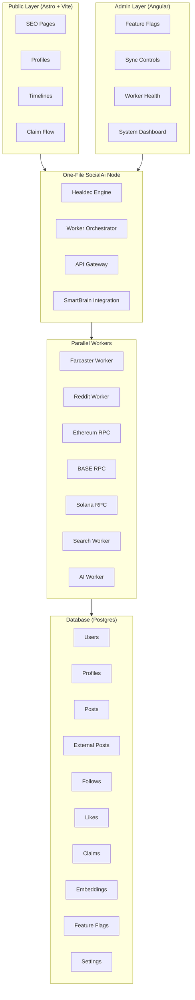

# SocialAi Architecture

This document provides a visual representation of the SocialAi application architecture, showing the key components and their relationships.

## System Architecture Flowchart

## Component Descriptions

### Public Layer (Astro + Vite)
The public-facing layer of SocialAi, built with Astro and Vite for optimal performance and SEO:
- **SEO Pages**: Search engine optimized landing pages
- **Profiles**: User profile pages
- **Timelines**: Social activity feeds
- **Claim Flow**: Identity verification and claiming process

### Admin Layer (Angular)
Administrative interface for system management and monitoring:
- **Feature Flags**: Toggle features on/off
- **Sync Controls**: Manage data synchronization
- **Worker Health**: Monitor worker status
- **System Dashboard**: Overall system metrics

### Backend (One‑File SocialAi Node)
Core backend service powered by Healdec:
- **Healdec Engine**: Auto-healing orchestration engine
- **Worker Orchestrator**: Manages parallel workers
- **API Gateway**: Request routing and handling
- **SmartBrain Integration**: AI-powered features integration

### Parallel Workers
Independent worker processes for various data sources and operations:
- **Farcaster Worker**: Syncs Farcaster Hub data
- **Reddit Worker**: Syncs Reddit content
- **Ethereum RPC**: Ethereum blockchain interactions
- **BASE RPC**: BASE blockchain interactions
- **Solana RPC**: Solana blockchain interactions
- **Search Worker**: Search indexing and queries
- **AI Worker**: AI processing tasks

### Database (Postgres)
PostgreSQL database storing all application data:
- **Users**: User accounts
- **Profiles**: User profile information
- **Posts**: Internal posts
- **External Posts**: Posts from external sources
- **Follows**: Social graph connections
- **Likes**: User interactions
- **Claims**: Identity claims
- **Embeddings**: AI vector embeddings
- **Feature Flags**: Feature toggle states
- **Settings**: System configuration

## Data Flow

1. **Public requests** flow from the Public Layer to the Backend
2. **Admin requests** flow from the Admin Layer to the Backend
3. The **Backend** orchestrates Workers to perform operations
4. **Workers** interact with the Database for data persistence and retrieval
